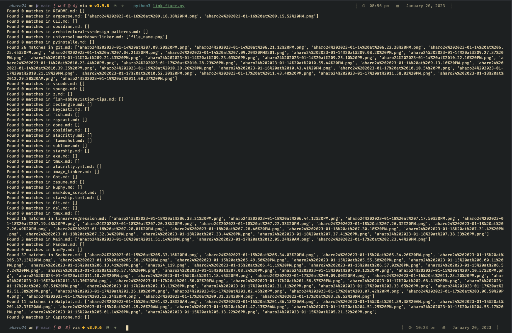

# **Obsidian Image Tool**

## linking 397 files in 5 seconds


### Author
-  This tool was developed and is maintained by [Angel Haro](https://www.linkedin.com/in/aharoJ/)

## **Description**

A command-line tool for adjusting image links in Obsidian markdown files for compatibility with GitHub repositories.

- **Clean:** Converts relative image links to direct links for local use.
- **Link:** Modifies image links to use relative paths suitable for GitHub.

---

## **Usage Instructions**

### **Prerequisites**

- **Operating System:** macOS  && Linux OS
- **Executable File:** `obsidian_image_tool` 

### **Setup and Execution**

1. **Place the Executable in Your Workspace Root**

   - Copy the `obsidian_image_tool` executable to the root directory of your workspace containing your Obsidian markdown files.

2. **Make the Executable Runnable**

   ```bash
   chmod +x obsidian_image_tool
   ```

3. **Run the Tool**

   ```bash
   ./obsidian_image_tool
   ```

4. **Select an Option**

   ```
   Select an option:
   [1] Clean
   [2] Link
   [q] Quit
   Enter your choice:
   ```

   - **[1] Clean:** Removes relative paths from image links for local use.
   - **[2] Link:** Adds relative paths to image links for GitHub compatibility.
   - **[q] Quit:** Exits the program.

5. **Wait for the Operation to Complete**

   - The tool will process all `.md` files in your workspace and subdirectories.
   - Upon completion, you'll see a confirmation message.

6. **Repeat or Quit**

   - After each operation, the menu reappears.
   - Perform additional operations or press `q` to quit.

---

## **Important Notes**

- **Workspace Directory:**
  - The tool must be placed and run from the root directory of your workspace.
  - It operates on the current working directory.

- **Permissions:**
  - Ensure you have read and write permissions for all files in your workspace.
  - Use `chmod +x obsidian_image_tool` to make the executable runnable.

- **Backup:**
  - It's recommended to backup your workspace before running the tool, as it modifies files in place.

- **Attachment Directory:**
  - The tool assumes images are stored in a directory named `z`.
  - If your attachment directory has a different name, please contact the author.

- **Feedback:**
  - If you prefer to specify a full path instead of placing the executable in the working directory, feel free to reach out with your suggestions.

---

## **License**

**Obsidian Image Tool** is provided under a **Source-Available License**.

- **Usage:** Permitted for personal, non-commercial purposes.
- **Modification:** Not allowed.
- **Commercial Use:** Strictly prohibited.


---

## **Contributing**

- For suggestions or feedback, please contact me.

---

## **Contact Information**

- **Author:** Angel Jair Haro
- **Email:** angel@aharoj.io
- **Website:** [PORTFOLIO](https://www.aharoj.io)

---

## **Disclaimer**

- **No Warranty:** This tool is provided "as is" without any warranties.
- **Limitation of Liability:** The author is not liable for any damages arising from the use of this tool.
- **Use at Your Own Risk:** Users assume all risks associated with using this tool.

---

## **Acknowledgments**

- Thank you for using the Obsidian Image Tool.
- Your feedback is valuable and helps improve the tool.

---