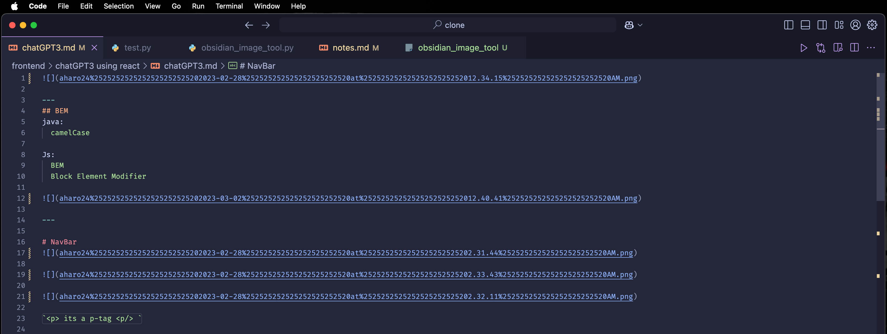

# **Universal Markdown Linker for GITHUB**

**MarkdownImageLinker** is a Python tool designed to simplify and manage image links in markdown files. It automatically fixes relative paths, handles file movements or renaming, and ensures your markdown images remain viewable, regardless of how your directories or files are structured. Perfect for GitHub documentation, note-taking apps like Obsidian, or any markdown-based workflows.

## 🚀 Features

- **Dynamic Path Adjustment**: Automatically updates image paths when markdown files or attachments are moved, renamed, or nested in subdirectories.  
- **Dual Operations**:
  - **Clean**: Simplifies image paths into viewable URLs, handling URL encoding for filenames with spaces or special characters.
  - **Link**: Reattaches valid paths for images located in a designated attachment directory, ensuring seamless previews.  
- **Alt Text Support**: Handles image links with or without alt text, preserving metadata and annotations.  
- **Recursive Directory Traversal**: Processes all markdown files in the workspace, including deeply nested subdirectories.  
- **Cross-App Compatibility**: Tested and compatible with markdown-based apps like Obsidian, Typora, and GitHub.  

## 🛠 How It Works

MarkdownImageLinker scans your workspace, identifies image links, and ensures all paths are valid and consistent. It uses Python's `os` and `re` modules for file handling and regex-based pattern matching.

### Workflow:
1. **Clean**: Simplifies complex relative links (e.g., `../../attachments/image.png`) into clean, encoded paths.
2. **Link**: Updates paths to point to a centralized attachment directory, ensuring accurate references even after file reorganizations.

---

## 🛠 Installation 

> You’ll need to clone the repository and execute the prebuilt binary file. 

Here’s how:

1. Clone the repository:
   ```bash
   git clone https://github.com/aharoJ/MarkdownImageLinker.git
   cd MarkdownImageLinker
   ```

2. Grant execute permissions to the binary:
   ```bash
   chmod +x link
   ```

3. Run the tool:
   ```bash
   ./link
   ```


---

## 📖 Usage

Run the script and choose an option:

```plaintext
Select an option:
[1] Clean
[2] Link
[q] Quit
```

- **[1] Clean**: Simplifies and sanitizes image paths for readability and compatibility.  
- **[2] Link**: Adjusts image paths to reference a centralized `attachments` directory.  
- **[q] Quit**: Exits the tool.

---

## 📝 Examples

### Before:
```markdown


```

### After (Clean Operation):
```markdown


```

### After (Link Operation):
```markdown


```

---

## 🤝 Contributing

Contributions are welcome! If you have ideas for new features or improvements, feel free to open an issue or submit a pull request.

---

## 👨‍💻 Author

- [Angel J. Haro](https://aharoj.io)  


## Images 

> options 


> un-link



> link 

